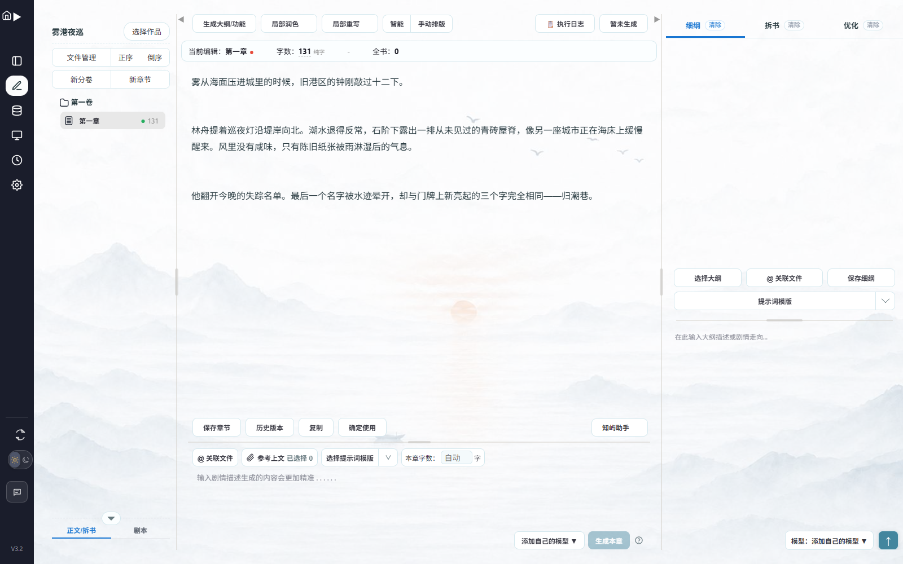
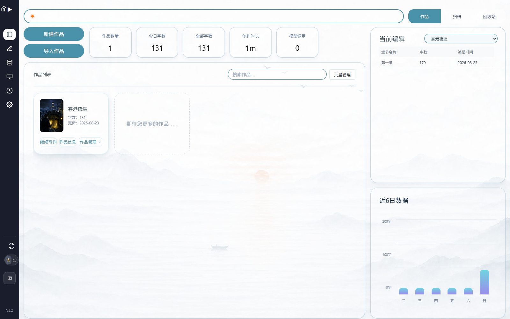
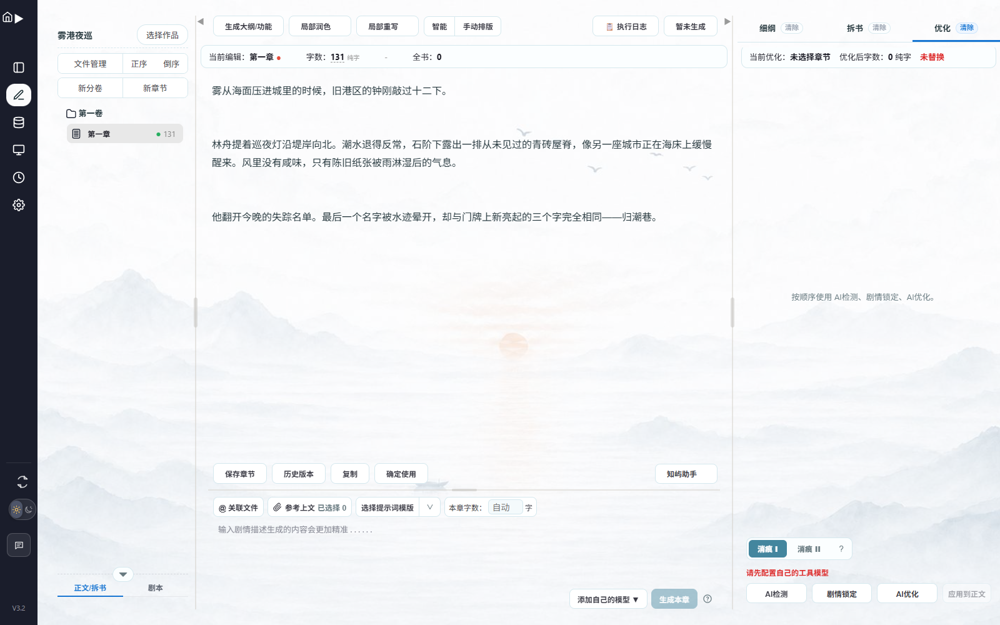
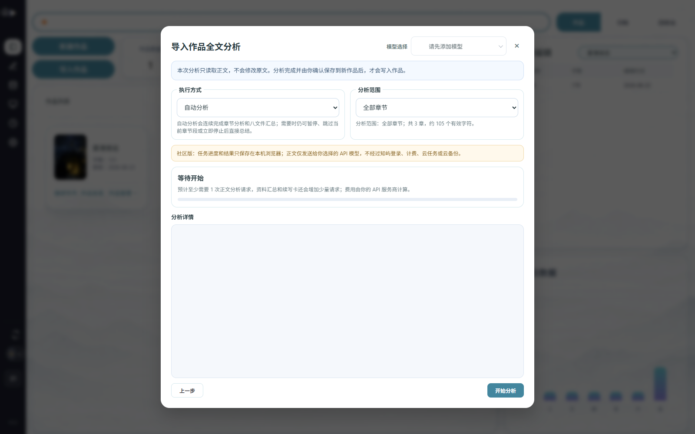
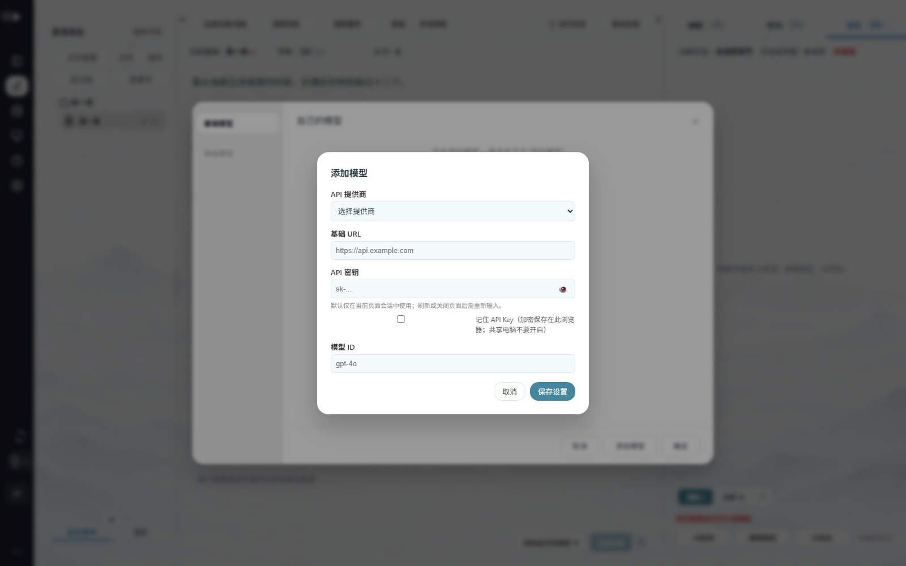

<p align="center">
  
</p>

<h1 align="center">知屿写作 Omniisle Write</h1>

<p align="center">
  面向中文长篇创作的本地优先写作工作台：管理作品、组织大纲与记忆、生成正文、优化表达并分析整部长篇。
</p>

<p align="center">
  <a href="https://github.com/fzc13306355765-glitch/omniisle-write/actions/workflows/ci.yml"></a>
  <a href="LICENSE"></a>
  
  
  <a href="https://github.com/fzc13306355765-glitch/omniisle-write/stargazers"></a>
</p>

<p align="center">
  简体中文 · <a href="README_EN.md">English</a> ·
  <a href="#快速开始">快速开始</a> ·
  <a href="#界面预览">界面预览</a> ·
  <a href="https://www.omniisle.com/">知屿写作线上版</a>
</p>

> [!IMPORTANT]
> 当前是 `0.1.0-alpha.1` 社区候选版，界面和写作流程以中文网文为主。它不包含知屿账号、云同步、登录、积分、支付、管理后台或托管模型。使用 AI 功能时，请配置你自己的兼容模型 API。



## 为什么是知屿写作

长篇写作不只是一个输入框。作品、分卷、章节、大纲、人物设定、前文关联、修改记录和整书分析需要在同一条工作流中持续衔接。

知屿写作社区版把这些能力放在本机浏览器中：不要求注册，不依赖知屿后端；不使用 AI 时也能进行本地写作，需要 AI 时再由使用者连接自己的模型服务。

| 写作阶段 | 社区版提供的能力 |
| --- | --- |
| 作品组织 | 作品、分卷、章节、归档、回收站、搜索和批量管理 |
| 创作准备 | 普通大纲、高级大纲、阶段粗纲、细纲、角色与世界观等功能性生成 |
| 上下文管理 | 记忆库、关联文件、参考上文、提示词模板和用户模板 |
| 正文工作 | 正文生成、富文本编辑、自动保存、历史版本、查找替换和排版 |
| 修改优化 | 局部润色、局部重写、AI检测、剧情锁定、AI优化、消痕 I / II |
| 长篇分析 | 导入章节、范围选择、自动或分阶段分析、本机检查点和八份分析资料 |
| 本地管理 | 作品导入导出、备份恢复、日间/夜间模式、主题与操作引导教程 |

## 界面预览

以下图片来自当前社区候选版的真实运行界面，作品名称、封面和正文均为演示内容。

<table>
  <tr>
    <td width="50%">
      
      <br><strong>作品总览</strong><br>集中管理作品、最近章节、写作字数、归档与回收站。
    </td>
    <td width="50%">
      
      <br><strong>可复核的 AI 优化</strong><br>消痕 I 按 AI检测、剧情锁定、AI优化执行；结果确认后才覆盖正文。
    </td>
  </tr>
  <tr>
    <td width="50%">
      
      <br><strong>全文分析</strong><br>选择章节范围和执行方式，进度与八份资料保存在本机检查点。
    </td>
    <td width="50%">
      
      <br><strong>用户自备模型</strong><br>填写提供商、基础 URL、API Key 和模型 ID；默认不长期保存密钥。
    </td>
  </tr>
</table>

## 快速开始

### 环境要求

- Node.js 20 或更高版本
- 电脑端 Chrome 或 Microsoft Edge；当前候选版已在 Windows 上完成实际验收

### 运行社区版

```bash
git clone https://github.com/fzc13306355765-glitch/omniisle-write.git
cd omniisle-write
npm ci
npm run build
npm run serve
```

浏览器打开终端显示的本机地址，默认是 <http://127.0.0.1:8081/>。不要直接双击 `index.html`，否则浏览器存储和模块加载可能无法正常工作。

第一次使用可以点击页面顶部的操作引导入口。教程会使用隔离的演示数据，不会调用模型，也不会写入真实作品。

## 配置自己的模型

1. 在写作页面点击“添加自己的模型”。
2. 选择提供商，或选择“自定义中转站”。
3. 填写基础 URL、API Key 和模型 ID，然后保存。
4. 在正文生成、工具模型或全文分析入口选择刚添加的模型。
5. 第一次请求前确认页面显示的目标域名，只向你信任的接口发送稿件。

API Key 默认只在当前页面会话中使用，刷新或关闭页面后需要重新输入。只有主动开启“记住 API Key”并再次确认后，密钥才会加密保存在当前浏览器中。模型的可用性、额度和费用由你选择的服务商决定，本仓库不提供模型额度。

## 数据、隐私与备份

- 作品、章节、模板、历史版本和全文分析检查点保存在当前浏览器中。
- 清理浏览器数据、重装浏览器或更换电脑可能导致本地作品丢失，请定期导出备份。
- 社区版默认阻止未确认的外部请求；AI 稿件只发送到使用者确认的模型地址，不经过知屿服务器。
- 用户自行导入的作品、提示词、图片、API Key 和模型配置不属于本仓库，不会因为使用本软件而被公开。
- 社区版不包含账号、云存储、计费、支付、运营数据或管理后台。

详细边界见 [隐私说明](PRIVACY.md)、[全文分析开源说明](docs/full-analysis-open-source-notices.md)和[公开状态](OPEN-SOURCE-STATUS.md)。

## 社区版、线上版与企业合作

| 版本 | 适合谁 | 提供什么 |
| --- | --- | --- |
| GitHub 社区版 | 愿意自行运行并配置模型的作者、开发者 | 本地写作、用户自备 API，不含知屿账号和云服务 |
| [知屿写作线上版](https://www.omniisle.com/) | 希望打开网页直接使用并由知屿持续维护的作者 | 独立运行的账号、计费、在线服务和持续维护 |
| 企业本地部署 | 对稿件保密、内部权限或多人协作有明确要求的机构 | 根据实际需求另行评估的企业内部系统，不包含在本仓库中 |

本仓库只提供社区版。社区版公开不会使线上版停止收费，也不代表线上版后端、用户数据或商业服务代码需要公开。具体说明见 [COMMERCIAL.md](COMMERCIAL.md)。

## 项目状态与路线图

- 当前版本：`0.1.0-alpha.1`
- 当前公开结论：本地候选门禁为 **GO**；详细证据见 [OPEN-SOURCE-STATUS.md](OPEN-SOURCE-STATUS.md)
- 已验证：Chrome、Microsoft Edge、核心本地写作、API Key 边界、AI优化链路和全文分析流程
- 尚未提供：正式安装包、云同步、托管模型和英文界面

后续方向见 [ROADMAP.md](ROADMAP.md)，版本变化见 [CHANGELOG.md](CHANGELOG.md)。

## 参与项目

- 使用问题：先阅读 [SUPPORT.md](SUPPORT.md)，再提交 [GitHub Issue](https://github.com/fzc13306355765-glitch/omniisle-write/issues)
- 安全问题：按 [SECURITY.md](SECURITY.md) 私下报告，不要公开稿件、API Key 或可利用细节
- 代码贡献：阅读 [CONTRIBUTING.md](CONTRIBUTING.md)、[CODE_OF_CONDUCT.md](CODE_OF_CONDUCT.md)和[CLA.md](CLA.md)
- 商业许可：闭源集成或其他授权方式见 [COMMERCIAL.md](COMMERCIAL.md)

如果这个项目对你有帮助，欢迎 Star、提交可复现的问题或参与改进。

## 开发与验证

```bash
npm test
npm run licenses:check
npm run secrets:check
npm run audit:public
```

上述检查覆盖社区运行包、本机写作边界、全文分析、API Key 保存、第三方许可证、密钥和公开边界。每次公开提交前都应保持通过。仓库维护者设置见 [GitHub 免费上线设置](GITHUB-SETUP.md)。

## 许可证与权利

除第三方组件和另有说明的素材外，由 Zeyu 原创或依法持有权利的代码按 [GNU Affero General Public License v3.0](LICENSE)（`AGPL-3.0-only`）公开。闭源集成或其他许可可以由权利人另行书面授权；外部贡献需要接受 [贡献者许可协议](CLA.md)。

Logo、壁纸、演示封面、文档截图、商标和第三方组件并不自动适用同一种许可。再分发前请阅读 [素材许可清单](ASSETS-LICENSES.md)、[商标政策](TRADEMARKS.md)、[NOTICE](NOTICE)和[第三方依赖清单](THIRD_PARTY_NOTICES.md)。
